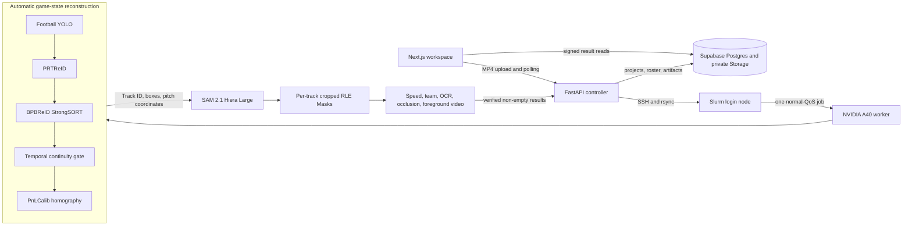

# PitchVision — Automatic Football Tracking with SAM 2.1

PitchVision is an end-to-end football video intelligence system. Upload one
continuous MP4 and it automatically detects the people on the pitch, assigns
Track IDs, reconstructs the pitch geometry, computes a pixel-accurate SAM 2.1
Mask for every valid Track, and returns an interactive analysis workspace.

The initial view stays lightweight: every visible subject gets a thin box and
ID. Click a player to lazy-load only that Track's Mask and show the trajectory,
speed, distance, team, role, jersey identity confidence and occlusion summary.
No first-frame boxes, manual calibration, login page or per-click GPU job are
required.

This is a portfolio-grade system rather than a model notebook. It integrates a
compact Next.js interface, typed FastAPI control plane, Supabase persistence,
Slurm orchestration, a football-specific detector/ReID/tracker/calibrator, SAM
video segmentation, reproducible artifact checks and measured A40 performance.

## Product flow

1. Open the local workspace and upload an H.264 MP4.
2. FastAPI stores the source in a private owner-scoped Supabase path and submits
   one Slurm job.
3. The A40 job runs Normalize, Detect/Track/Calibrate, Segment, Identify and
   Upload stages.
4. The result page draws all current Track boxes without downloading dozens of
   full-resolution Masks.
5. Clicking a box selects the smallest overlapping box under the pointer, then
   downloads and caches only `masks/{track_id}.json.gz`.
6. Clicking another person switches immediately; previously loaded Masks remain
   in the browser cache.
7. A verified Supabase roster can override an uncertain automatic identity and
   persists after refresh.

The present release processes offline MP4 files. RTSP/HLS, browser cameras,
handheld cameras and drone feeds are a future input layer over the same
normalized-frame boundary.

## Architecture



### Layer responsibilities

| Layer | Technology | Responsibility |
| --- | --- | --- |
| Web | Next.js 16, React 19, TypeScript, Tailwind, Canvas | Direct upload, real progress, box hit-testing, lazy Mask rendering, trajectory, pitch heatmap, identity correction |
| Controller | FastAPI, Pydantic, Supabase client | Local-admin ownership, validation, Storage sync, SSH/rsync, Slurm state, result verification |
| Game state | SoccerNet/SoccerMaster, football YOLO, PRTReID, BPBReID StrongSORT, PnLCalib | Person detection, persistent Track IDs and per-frame pitch calibration |
| Segmentation | SAM 2.1 Hiera Large, PyTorch, CUDA | Track-conditioned pixel Mask propagation across valid lifetimes |
| Analytics | OpenCV, NumPy, EasyOCR, FFmpeg | Foot points, metric speed, jersey colour/team, number voting, occlusion metrics, foreground export |
| Data | Supabase Postgres, private Storage, RLS | Projects, tracks, verified roster, source videos, final artifacts |
| Compute | Slurm, one NVIDIA A40 | Reproducible offline inference without a permanent GPU service |

## Why the hybrid architecture

YOLO and SAM solve different problems.

- The football detector answers **who is visible and where?**
- PRTReID + StrongSORT answer **which temporal identity owns this box?**
- PnLCalib answers **where is the image point on a 105 x 68 metre pitch?**
- SAM answers **which pixels belong to this Track?**

Using SAM as the identity tracker would make IDs depend on segmentation memory.
Using detector boxes as the final visualization would lose body contours and
foreground extraction. PitchVision keeps Track ID as the identity authority and
SAM as the pixel authority.

All valid Track Masks are precomputed once on the A40. “On demand” refers to
browser transfer, decoding and rendering—not starting a new GPU job after a
click. This keeps interaction immediate while avoiding an initial download of
every full-video Mask.

## GPU pipeline

### 1. Normalize

- Accept MP4/H.264, maximum 50 MB and 60 seconds in the demo API.
- Normalize to a maximum of 1280 x 720 at 15 FPS without enlarging the source.
- Extract ordered JPEG frames for SAM and retain `normalized.mp4` as the exact
  coordinate space used by all outputs.

### 2. Reconstruct game state

- Run the football-specific `yolo_v8x6_finetuned.pt` detector.
- Compute PRTReID embeddings and update BPBReID StrongSORT identities.
- Keep StrongSORT IDs authoritative and disable SoccerNet's global
  appearance-only tracklet concatenation. Players on one team share a kit, so
  merging disjoint fragments by ReID distance alone can silently join two
  different people. The tracker retains at most three seconds of missed state
  at the 5 FPS reconstruction rate and otherwise issues a new ID.
- Estimate keypoints, pitch lines and per-frame homography with PnLCalib.
- Exclude off-pitch people when calibration is available while retaining tracks
  if calibration is unavailable.
- Treat tracks shorter than two seconds as detector fragments, not unique
  analysis subjects.

The measured fast profile analyzes game state at 5 FPS and maps observations
back to the 15 FPS SAM timeline. Detection, ReID, tracking and calibration run
inside one TrackLab process so models and video metadata are not repeatedly
initialized.

### 3. Segment every valid Track

- Load `sam2.1_hiera_large.pt` on CUDA with BF16, TF32 and cuDNN benchmarking.
- Keep Track ID ownership fixed; SAM never invents or reassigns an ID.
- Use the first valid detection and one high-quality later box/body-point prompt.
- Propagate once in the forward direction. The conservative controller default
  is 64 objects per batch; the measured A40 acceptance run used a 96-object
  ceiling and processed all 71 accepted Tracks in one batch.
- Reject a predicted Mask on a detector-observed frame when its Mask/box IoU is
  below `0.1`.
- Crop each RLE payload to its non-zero rectangle while retaining full-frame
  dimensions. Legacy full-frame RLE remains readable.

The default deliberately disables the compiled VOS path: on the tested
PyTorch/CUDA stack, dynamic object counts caused recompilation and slower
first-run performance. `SAM_BIDIRECTIONAL=true` remains available for a slower
quality-comparison profile.

### 4. Derive analytics

- Define the foot point as the median horizontal location of the bottom 5% of
  Mask pixels.
- Project valid foot points through that frame's homography.
- Smooth speed with a five-frame median filter followed by EMA, then report
  current/average/maximum km/h and cumulative distance.
- Hide metric values when calibration is invalid; never fabricate `0 km/h`.
- Classify team/referee from the upper-body Mask colour in Lab space.
- Run digit-only EasyOCR on a small set of sharp per-track torso crops and fuse
  it with upstream jersey evidence.
- Return a name only when confidence is high and `team + number` matches the
  verified Supabase roster. Otherwise return `Unidentified`.
- Report occlusion count, ID retention, area recovery, centroid shift and
  recovery frames.

The default fast role classifier uses appearance and pitch position. The large
Qwen vision-language role model is an explicit optional experiment and is not
downloaded or executed by the normal profile.

## Result contract

| Artifact | Purpose |
| --- | --- |
| `masks/{track_id}.json.gz` | One Track's frame-indexed cropped RLE Masks for lazy loading |
| `tracks.json` | Boxes, trajectory, speed, distance, role, team, identity and occlusion metrics |
| `calibration.json.gz` | Per-frame homography, confidence and validity |
| `foreground.mp4` | H.264 black-background export of all accepted on-pitch people |
| `metrics.json` | Stage timings, throughput, configuration, GPU utilization, VRAM and object counts |
| `normalized.mp4` | Exact normalized video used by detection, calibration and segmentation |

Historical manual projects with one `masks.json.gz` remain readable. New
`auto_all` jobs write one Mask file per Track.

Private Storage paths are owner scoped:

```text
videos/{user_id}/{project_id}/source.mp4
artifacts/{user_id}/{project_id}/masks/{track_id}.json.gz
artifacts/{user_id}/{project_id}/{artifact_name}
```

## Supabase model

- `projects`: source/result paths, teams, analysis mode, Slurm Job ID, stage,
  progress, calibration path and terminal state.
- `tracks`: persistent object ID, lifetime, detector confidence, Mask path,
  trajectory/speed, automatic identity, optional manual roster override and
  audit metrics.
- `roster`: match, team, squad number, name and position.

The 2026 final squads were checked against the
[FIFA official squad list](https://fdp.fifa.org/assetspublic/ce281/pdf/SquadLists-English.pdf?gsid=443db88c-96e5-42c4-b06c-3df8068412b7),
the [RFEF Spain announcement](https://rfef.es/en/noticias/The-26-Players-Who-Will-Aim-to-Reclaim-World-Cup-Glory),
and the [AFA Argentina announcement](https://www.afa.com.ar/Sitio/posts/lista-de-los-26-jugadores-de-la-seleccion-argentina-para-defender-el-titulo-en-la-copa-del-mundo-2026).
The demonstration match context is documented by the
[FIFA final report](https://www.fifa.com/en/tournaments/mens/worldcup/canadamexicousa2026/articles/spain-argentina-final-report-highlights).

## Measured A40 acceptance

The final acceptance workload is one continuous 30-second, 1280 x 720, 15 FPS
broadcast clip with no manual prompts or calibration points. The table below is
filled only from the final verified Slurm result bundle.

| Metric | Measured result |
| --- | ---: |
| Slurm state / exit code | `COMPLETED / 0:0` |
| Slurm wall time | `16m 22s` |
| Frames / valid Track lifetimes | `450 / 71` |
| Raw / accepted tracker IDs | `538 / 71` |
| Median / maximum people visible per frame | `12 / 16` |
| End-to-end worker time / throughput | `974.20s / 0.46 FPS` |
| Game-state reconstruction time | `243.80s` |
| SAM segmentation time | `669.01s` |
| Mask post-processing / OCR time | `38.34s / 5.16s` |
| Average / peak GPU utilization | `57.54% / 100%` |
| NVIDIA / PyTorch peak memory | `33,883 / 31,580 MB` |
| Automatic calibration valid rate | `450/450 (100%)` |
| Mask-box IoU mean / median / p10 | `0.4825 / 0.4880 / 0.1827` |
| Mask centroid inside detector box | `84.71%` |
| Long gaps over 3s / impossible short jumps | `0 / 0` |
| Fully decoded result videos | `450/450 + 450/450 frames` |

The validator checks structural and internal consistency, not ground-truth
accuracy. A detector box is not a human Mask annotation, so Mask/box IoU must not
be misreported as segmentation IoU. Likewise, this clip does not provide
ground-truth identities or surveyed control points; therefore the repository
does not claim measured IDF1, human-labelled Mask IoU or metric projection error.

The original stretch target was 15 minutes. This quality-first run finished in
16 minutes 22 seconds, so the target was missed by 82 seconds; the measured
number is reported instead of rounding it down.

The wide broadcast source makes many jersey numbers physically unreadable. A
zero-name automatic result on such footage is an honest `Unidentified` outcome,
not evidence that the verified roster or manual correction path is broken.

## Author's design philosophy

1. **Identity and pixels need separate owners.** Tracking-by-detection owns the
   ID; SAM owns the contour. Mixing those responsibilities makes failures hard
   to diagnose.
2. **Immediate interaction is a data-layout problem.** Precompute all valid
   Masks once, split them by Track, then transfer and render only the selected
   subject.
3. **A wrong identity is worse than a new identity.** Temporal tracking gates,
   disabled global appearance-only concatenation and a two-second validity gate
   avoid presenting detector fragments as meaningful people or stitching two
   similar shirts into one player.
4. **Speed comes from removing wasted work.** Low-rate game-state analysis,
   combined model stages, one SAM direction, vectorized cropped RLE and removal
   of a default 7B role model reduce real latency. Allocating dummy tensors to
   “fill VRAM” does not.
5. **Missing evidence must stay missing.** Invalid calibration means no metric
   speed; unreadable numbers mean `Unidentified`; an unlabelled clip means no
   fabricated IDF1 or Mask IoU claim.
6. **Artifacts are the completion gate.** A successful Python process or Slurm
   state is insufficient. Every gzip must decode, both videos must fully play,
   result counts must agree and the browser must load a selected Track.
7. **Keep the control plane small.** FastAPI, system SSH/rsync, one Slurm job and
   Supabase are enough for the offline workload. Redis, Celery and a permanent
   GPU service can wait until live input creates real backpressure.

## API

| Method | Endpoint | Description |
| --- | --- | --- |
| `GET` | `/health` | Controller and scheduler identity |
| `POST` | `/v1/offline/jobs` | Direct local-admin MP4 upload and automatic submission |
| `GET` | `/v1/offline/jobs/{project_id}` | Offline stage, progress, Job ID and Track count |
| `GET` | `/v1/offline/latest` | Most recent local-admin job |
| `POST` | `/v1/jobs` | Typed project submission; retains legacy `manual_sam` compatibility |
| `GET` | `/v1/jobs/{project_id}` | Job state from Supabase, `squeue` and `sacct` |
| `GET` | `/v1/projects/{project_id}/results` | Project, roster, tracks and signed result URLs |
| `PATCH` | `/v1/projects/{project_id}/tracks/{object_id}/identity` | Apply or clear a roster override |

Terminal states are `completed` only when Slurm succeeds and all required result
files are present and non-empty.

## Repository layout

```text
.
├── web/                         Next.js upload and interactive result workspace
├── backend/
│   ├── app/                     FastAPI, ownership, Supabase and Slurm control
│   ├── gsr/                     Original integration configs/export adapters
│   ├── worker/                  Game state, SAM propagation, RLE and analytics
│   ├── scripts/                 Runtime bootstrap, sbatch and artifact validator
│   └── tests/                   API, tracking, RLE, identity and analytics tests
├── supabase/migrations/         Schema, RLS, Storage, auto tracking and roster
├── SETUP.md                     Reproducible setup and operating guide
├── THIRD_PARTY_NOTICES.md       Model sources, pins, checksums and licenses
└── .env.example                 Public configuration names without secrets
```

Footage, checkpoints, generated videos/Masks, remote environments, local caches,
credentials and screenshots are excluded from Git.

## Quick start and verification

Follow [SETUP.md](./SETUP.md) for Supabase and A40 bootstrap details.

```bash
# Backend
cd backend
uv sync --extra test
uv run uvicorn app.main:app --reload --host 127.0.0.1 --port 8000

# Frontend, another terminal
cd web
npm ci
npm run dev
```

Verification:

```bash
backend/.venv/bin/python -m pytest -q
cd web
npm test -- --run
npm run lint
npm run build
```

The current codebase passes 50 backend tests, 6 frontend tests, ESLint and the
Next.js production build. GPU artifacts are additionally checked with
`backend/scripts/validate_artifacts.py`.

## Limitations and roadmap

- Continuous shots only. A camera cut creates new IDs; cross-shot identity is not
  promised.
- Very short appearances are kept out of expensive Mask analysis until they
  persist for two seconds.
- OCR depends on actual torso pixel resolution and does not guess names.
- Automatic calibration may be unavailable for tight, replay or non-pitch views.
- Public or commercial deployment requires authentication, privacy review,
  licensed footage and review of every upstream model/software license.
- Next: RTSP/HLS/WebRTC adapters, browser/field/drone cameras, bounded frame
  queues, backpressure, latency telemetry and multi-camera identity experiments.

See [THIRD_PARTY_NOTICES.md](./THIRD_PARTY_NOTICES.md) before building or
redistributing the GPU runtime.
