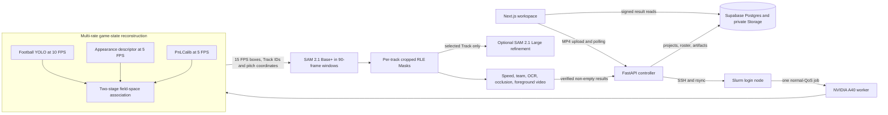

# PitchVision — Automatic Football Tracking with SAM 2.1

PitchVision is an end-to-end football video intelligence system. Upload one
continuous MP4 and it automatically detects the people on the pitch, assigns
Track IDs, reconstructs the pitch geometry, computes a pixel-accurate SAM 2.1
Mask for every valid Track, and returns an interactive analysis workspace.

The initial view stays lightweight: every visible subject gets a thin box and
ID. Click a player to lazy-load only that Track's Mask and show the trajectory,
speed, distance, team, role, jersey identity confidence and occlusion summary.
No first-frame boxes, manual calibration or login page are required. Base+
Masks are immediately available after the offline analysis. A selected player
can optionally be reprocessed by SAM Large as an explicit quality upgrade.

This is a portfolio-grade system rather than a model notebook. It integrates a
compact Next.js interface, typed FastAPI control plane, Supabase persistence,
Slurm orchestration, a football-specific detector/ReID/tracker/calibrator, SAM
video segmentation, reproducible artifact checks and measured A40 performance.

## Product flow

1. Open the local workspace and upload an H.264 MP4.
2. FastAPI stores the source in a private owner-scoped Supabase path and submits
   one Slurm job.
3. The A40 job runs Normalize, Detect/Track/Calibrate, Segment, Identify and
   Upload stages.
4. The result page draws all current Track boxes without downloading dozens of
   full-resolution Masks.
5. Clicking a box selects the smallest overlapping box under the pointer, then
   downloads and caches only `masks/{track_id}.json.gz`.
6. A directly verified Mask is drawn when available. If quality gating rejects
   one isolated frame, the browser projects the nearest verified Mask crop onto
   that Track's current detector box so the selected overlay does not blink;
   this display interpolation never changes stored inference metrics.
7. Clicking another person switches immediately; previously loaded Masks remain
   in the browser cache.
8. A verified Supabase roster can override an uncertain automatic identity and
   persists after refresh.

Roster data is optional. Arbitrary footage uses `Unspecified Match`, `Team A`
and `Team B`; when no matching roster rows exist, identity stays
`Unidentified` while boxes, Masks, trajectories, speed, distance and occlusion
analytics continue normally.

The present release processes offline MP4 files. RTSP/HLS, browser cameras,
handheld cameras and drone feeds are a future input layer over the same
normalized-frame boundary.

## Architecture



### Layer responsibilities

| Layer | Technology | Responsibility |
| --- | --- | --- |
| Web | Next.js 16, React 19, TypeScript, Tailwind, Canvas | Direct upload, real progress, box hit-testing, lazy Mask rendering, trajectory, pitch heatmap, identity correction |
| Controller | FastAPI, Pydantic, Supabase client | Local-admin ownership, validation, Storage sync, SSH/rsync, Slurm state, result verification |
| Game state | football YOLO, SciPy assignment, OpenCV appearance, PnLCalib | 10 FPS detection, field-registered two-stage association, camera-cut handling and interpolated calibration |
| Segmentation | SAM 2.1 Hiera Base+ and Large, PyTorch compile, CUDA | Windowed all-person Masks plus optional selected-player refinement |
| Analytics | OpenCV, NumPy, EasyOCR, FFmpeg | Fused foot observations, field-state smoothing, metric speed/distance, identity, occlusion and foreground export |
| Data | Supabase Postgres, private Storage, RLS | Projects, tracks, verified roster, source videos, final artifacts |
| Compute | Slurm, one NVIDIA A40 | Reproducible offline inference without a permanent GPU service |

## Why the hybrid architecture

YOLO and SAM solve different problems.

- The football detector answers **who is visible and where?**
- The field-space tracker answers **which temporal identity owns this box?**
- PnLCalib answers **where is the image point on a 105 x 68 metre pitch?**
- SAM answers **which pixels belong to this Track?**

Using SAM as the identity tracker would make IDs depend on segmentation memory.
Using detector boxes as the final visualization would lose body contours and
foreground extraction. PitchVision keeps Track ID as the identity authority and
SAM as the pixel authority.

All valid Base+ Track Masks are precomputed once on the A40. “On demand” first
means browser transfer, decoding and rendering, so clicking is immediate. The
separate Large button is an optional background refinement for one already
tracked person; it is never required to inspect the Base+ result.

## GPU pipeline

### 1. Normalize

- Accept MP4/H.264, maximum 50 MB and 60 seconds in the demo API.
- Normalize to a maximum of 1920 x 1080 at 15 FPS without enlarging the source.
- Extract ordered JPEG frames for SAM and retain `normalized.mp4` as the exact
  coordinate space used by all outputs.

### 2. Reconstruct game state at independent rates

- Run `yolo_v8x6_finetuned.pt` at 10 FPS and retain person detections down to
  confidence `0.05`.
- Match high-confidence detections first. A second pass may use a low-confidence
  box to recover an existing Track, but cannot create a new one.
- Score association as `0.45 field position + 0.25 image motion + 0.15 box IoU
  + 0.10 team + 0.05 appearance`. Team stays neutral until Mask colour is
  available, so it cannot force a merge.
- Sample the lightweight HSV appearance descriptor at 5 FPS. It is supporting
  evidence rather than the identity authority because same-team shirts are
  deliberately similar.
- Reject motion above the physical field gate, role changes and image jumps;
  create a new ID after 1.5 seconds unmatched. A broadcast cut clears all live
  Tracks immediately.
- Run PnLCalib independently at 5 FPS, smooth isolated coefficient spikes and
  interpolate homographies to the 15 FPS output timeline.

This replaces the old appearance-led StrongSORT default. PRTReID/StrongSORT
remain available in the remote compatibility environment but are not executed
by the normal profile.

### 3. Segment active lifetimes, then refine only when requested

- Load `sam2.1_hiera_base_plus.pt` for all people with BF16, TF32, cuDNN
  benchmarking and full VOS compile.
- Keep Track ID ownership fixed; SAM never invents or reassigns an ID.
- Split the video into 90-frame windows with 15-frame overlap. A Track is loaded
  only when its lifetime intersects that window and disappears from state when
  its lifetime ends.
- Process 16 identities per bucket and pad only the final compiled bucket to a
  fixed shape. Dummy corner identities are never written to results.
- Select up to three clear, low-occlusion box/body-point prompts and propagate
  both forward and backward inside the valid lifetime. Both directions start
  from one common conditioned anchor, partitioning the window instead of
  recomputing the frames between the earliest and latest prompts.
- Reject a predicted Mask on a detector-observed frame when its Mask/box IoU is
  below `0.1`.
- Crop each RLE payload to its non-zero rectangle while retaining full-frame
  dimensions. Legacy full-frame RLE remains readable.
- A user-selected Track may run `sam2.1_hiera_large.pt` in a one-object Slurm
  job. The refined object replaces only that Track's Mask after a non-empty
  result is verified.

### 4. Derive analytics

- Use the detector-box bottom centre as the stable base observation. A SAM
  bottom-5% foot point contributes a 20% correction only when Mask/box IoU is at
  least `0.65` and it is spatially plausible.
- Keep trajectory and speed observations on every accepted detection frame;
  an isolated rejected SAM frame affects only that pixel overlay, not the
  synchronized movement panel.
- Project observations through that frame's homography and run a robust
  five-frame median plus constant-velocity alpha-beta state estimate in metric
  field space.
- Reject speeds above 50 km/h, acceleration above 12 m/s² and calibration
  jumps. Compute cumulative distance from the smoothed trajectory rather than
  summing raw Mask jitter; hide maximum speed until a Track spans one second.
- Hide metric values when calibration is invalid; never fabricate `0 km/h`.
- Classify team/referee from the upper-body Mask colour in Lab space.
- Run digit-only EasyOCR on a small set of sharp per-track torso crops and fuse
  it with upstream jersey evidence.
- Return a name only when confidence is high and `team + number` matches the
  verified Supabase roster. Otherwise return `Unidentified`.
- Report occlusion count, ID retention, area recovery, centroid shift and
  recovery frames.

The default fast role classifier uses appearance and pitch position. The large
Qwen vision-language role model is an explicit optional experiment and is not
downloaded or executed by the normal profile.

## Result contract

| Artifact | Purpose |
| --- | --- |
| `masks/{track_id}.json.gz` | One Track's frame-indexed cropped RLE Masks for lazy loading |
| `tracks.json` | Boxes, trajectory, speed, distance, role, team, identity and occlusion metrics |
| `calibration.json.gz` | Per-frame homography, confidence and validity |
| `foreground.mp4` | H.264 black-background export of all accepted on-pitch people |
| `metrics.json` | Stage timings, throughput, configuration, GPU utilization, VRAM and object counts |
| `normalized.mp4` | Exact normalized video used by detection, calibration and segmentation |

Historical manual projects with one `masks.json.gz` remain readable. New
`auto_all` jobs write one Mask file per Track.

Private Storage paths are owner scoped:

```text
videos/{user_id}/{project_id}/source.mp4
artifacts/{user_id}/{project_id}/masks/{track_id}.json.gz
artifacts/{user_id}/{project_id}/{artifact_name}
```

## Supabase model

- `projects`: source/result paths, teams, analysis mode, Slurm Job ID, stage,
  progress, calibration path and terminal state.
- `tracks`: persistent object ID, lifetime, detector confidence, Mask path,
  trajectory/speed, automatic identity, optional manual roster override and
  audit metrics.
- `roster`: match, team, squad number, name and position.

The 2026 final squads were checked against the
[FIFA official squad list](https://fdp.fifa.org/assetspublic/ce281/pdf/SquadLists-English.pdf?gsid=443db88c-96e5-42c4-b06c-3df8068412b7),
the [RFEF Spain announcement](https://rfef.es/en/noticias/The-26-Players-Who-Will-Aim-to-Reclaim-World-Cup-Glory),
and the [AFA Argentina announcement](https://www.afa.com.ar/Sitio/posts/lista-de-los-26-jugadores-de-la-seleccion-argentina-para-defender-el-titulo-en-la-copa-del-mundo-2026).
The demonstration match context is documented by the
[FIFA final report](https://www.fifa.com/en/tournaments/mens/worldcup/canadamexicousa2026/articles/spain-argentina-final-report-highlights).

## Measured A40 acceptance

The final acceptance workload is one continuous 30-second, 1280 x 720, 15 FPS
broadcast clip with no manual prompts or calibration points. The table below is
filled only from the final verified Slurm result bundle.

| Metric | Measured result |
| --- | ---: |
| Slurm state / exit code | `COMPLETED / 0:0` |
| Slurm wall time | `14m 47s` |
| Frames / valid Track lifetimes | `450 / 44` |
| Field-space Track IDs created / retained | `45 / 44` |
| Minimum / median / maximum people visible per frame | `13 / 23 / 39` |
| End-to-end worker time / throughput | `878.67s / 0.51 FPS` |
| Game-state reconstruction time | `208.60s` |
| SAM segmentation time | `548.30s` |
| Mask post-processing / OCR time | `96.80s / 3.13s` |
| Average / peak GPU utilization | `39.32% / 100%` |
| NVIDIA / PyTorch peak memory | `15,561 / 4,128.61 MB` |
| Automatic calibration valid rate | `450/450 (100%)` |
| Mask-box IoU mean / median / p10 | `0.6028 / 0.6417 / 0.2836` |
| Mask centroid inside detector box | `91.35%` |
| Direct verified Mask coverage mean / median | `67.83% / 69.00%` |
| Active / dense object-frames | `12,194 / 19,800 (38.41% avoided)` |
| Tracks with metric speed | `43/44` |
| Long gaps over 3s / impossible short jumps | `0 / 0` |
| Fully decoded result videos | `450/450 + 450/450 frames` |

This acceptance used generic match metadata and an empty matching roster. All
44 identities therefore remained honestly unlabelled while 44 per-Track Mask
artifacts, continuous trajectories and 43 calibrated speed summaries were
produced. The per-frame direct Mask coverage is reported above; rejected frames
stay rejected in the artifacts even though the result player can visually bridge
an isolated gap from the nearest verified contour.

The validator checks structural and internal consistency, not ground-truth
accuracy. A detector box is not a human Mask annotation, so Mask/box IoU must not
be misreported as segmentation IoU. Likewise, this clip does not provide
ground-truth identities or surveyed control points; therefore the repository
does not claim measured IDF1, human-labelled Mask IoU or metric projection error.

The original 15-minute acceptance target was met by 13 seconds. The later
8–10-minute optimization target was not met: this quality-first run took 14
minutes 47 seconds. Model and compile caches are retained in scratch, but the
reported number remains the actual end-to-end Slurm wall time rather than a
projected warm-run estimate.

A separate selected-player SAM Large smoke job completed in 26 seconds and
returned 44 non-empty Mask frames out of a 45-frame lifetime. It validates the
refinement path; it is not included in the all-person wall time above.

The wide broadcast source makes many jersey numbers physically unreadable. A
zero-name automatic result on such footage is an honest `Unidentified` outcome,
not evidence that the verified roster or manual correction path is broken.

## Author's design philosophy

1. **Identity and pixels need separate owners.** Tracking-by-detection owns the
   ID; SAM owns the contour. Mixing those responsibilities makes failures hard
   to diagnose.
2. **Immediate interaction is a data-layout problem.** Precompute all valid
   Masks once, split them by Track, then transfer and render only the selected
   subject.
3. **A wrong identity is worse than a new identity.** Temporal tracking gates,
   disabled global appearance-only concatenation, a 0.7-second tracker gate and
   a two-second all-person Mask gate avoid presenting detector fragments as
   meaningful people or stitching two similar shirts into one player.
4. **Spend compute where evidence changes.** Detection needs 10 FPS, appearance
   and calibration do not; SAM needs 15 FPS contours but only over active Track
   lifetimes. Fixed compile shapes are useful, dummy VRAM allocation is not.
5. **Missing evidence must stay missing.** Invalid calibration means no metric
   speed; unreadable numbers mean `Unidentified`; an unlabelled clip means no
   fabricated IDF1 or Mask IoU claim.
6. **Artifacts are the completion gate.** A successful Python process or Slurm
   state is insufficient. Every gzip must decode, both videos must fully play,
   result counts must agree and the browser must load a selected Track.
7. **Keep the control plane small.** FastAPI, system SSH/rsync, one Slurm job and
   Supabase are enough for the offline workload. Redis, Celery and a permanent
   GPU service can wait until live input creates real backpressure.

## API

| Method | Endpoint | Description |
| --- | --- | --- |
| `GET` | `/health` | Controller and scheduler identity |
| `POST` | `/v1/offline/jobs` | Direct local-admin MP4 upload and automatic submission |
| `GET` | `/v1/offline/jobs/{project_id}` | Offline stage, progress, Job ID and Track count |
| `GET` | `/v1/offline/latest` | Most recent local-admin job |
| `POST` | `/v1/jobs` | Typed project submission; retains legacy `manual_sam` compatibility |
| `GET` | `/v1/jobs/{project_id}` | Job state from Supabase, `squeue` and `sacct` |
| `GET` | `/v1/projects/{project_id}/results` | Project, roster, tracks and signed result URLs |
| `PATCH` | `/v1/projects/{project_id}/tracks/{object_id}/identity` | Apply or clear a roster override |
| `POST` | `/v1/projects/{project_id}/tracks/{object_id}/refine` | Queue selected-player SAM Large refinement |
| `GET` | `/v1/projects/{project_id}/tracks/{object_id}/refine` | Poll refinement and return the refreshed signed Mask URL |

Terminal states are `completed` only when Slurm succeeds and all required result
files are present and non-empty.

## Repository layout

```text
.
├── web/                         Next.js upload and interactive result workspace
├── backend/
│   ├── app/                     FastAPI, ownership, Supabase and Slurm control
│   ├── gsr/                     Original integration configs/export adapters
│   ├── worker/                  Game state, SAM propagation, RLE and analytics
│   ├── scripts/                 Runtime bootstrap, sbatch and artifact validator
│   └── tests/                   API, tracking, RLE, identity and analytics tests
├── supabase/migrations/         Schema, RLS, Storage, auto tracking and roster
├── SETUP.md                     Reproducible setup and operating guide
├── THIRD_PARTY_NOTICES.md       Model sources, pins, checksums and licenses
└── .env.example                 Public configuration names without secrets
```

Footage, checkpoints, generated videos/Masks, remote environments, local caches,
credentials and screenshots are excluded from Git.

## Quick start and verification

Follow [SETUP.md](./SETUP.md) for Supabase and A40 bootstrap details.

```bash
# Backend
cd backend
uv sync --extra test
uv run uvicorn app.main:app --reload --host 127.0.0.1 --port 8000

# Frontend, another terminal
cd web
npm ci
npm run dev
```

Verification:

```bash
backend/.venv/bin/python -m pytest -q
cd web
npm test -- --run
npm run lint
npm run build
```

The current codebase passes 61 backend tests, 8 frontend tests, ESLint and the
Next.js production build. GPU artifacts are additionally checked with
`backend/scripts/validate_artifacts.py`.

## Limitations and roadmap

- Continuous shots only. A camera cut creates new IDs; cross-shot identity is not
  promised.
- The field tracker rejects detections shorter than roughly 0.7 seconds; the
  expensive all-person Mask stage requires two seconds of accepted presence.
  Unmatched live Tracks expire after 1.5 seconds.
- OCR depends on actual torso pixel resolution and does not guess names.
- Automatic calibration may be unavailable for tight, replay or non-pitch views.
- Public or commercial deployment requires authentication, privacy review,
  licensed footage and review of every upstream model/software license.
- Next: RTSP/HLS/WebRTC adapters, browser/field/drone cameras, bounded frame
  queues, backpressure, latency telemetry and multi-camera identity experiments.

See [THIRD_PARTY_NOTICES.md](./THIRD_PARTY_NOTICES.md) before building or
redistributing the GPU runtime.
