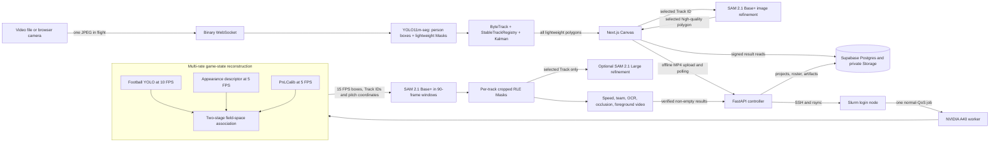
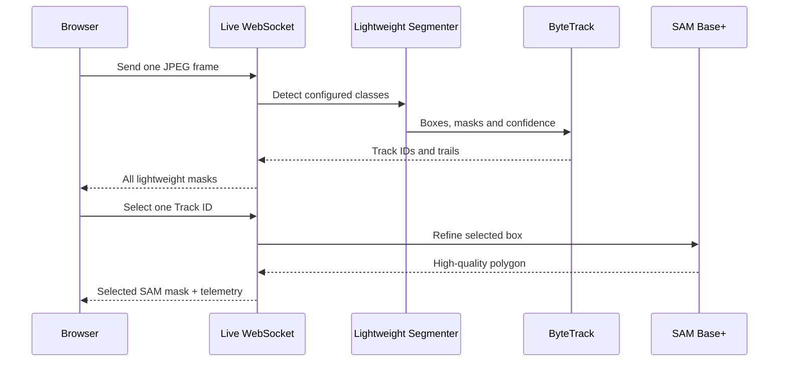

# PitchVision — Real-time Multi-Sport Person Masks with SAM 2.1

PitchVision is a two-mode person video intelligence system built for sports and
general human scenes:

- **Live:** a sport-agnostic YOLO11m-seg instance-segmentation model produces a lightweight
  Mask, box and persistent Track ID for every visible person. Clicking one
  Track replaces only that contour with a SAM 2.1 Base+ refinement while every
  other person continues through the lightweight path.
- **Offline:** the original football analytics pipeline reconstructs pitch
  geometry, precomputes high-quality SAM Masks, derives metric movement and
  persists auditable artifacts in Supabase.

The live model uses the COCO `person` class by default (additional classes can
be enabled with configuration), not a football class. The same path therefore applies
to football, basketball, athletics, training
sessions, handheld footage, field cameras and ordinary crowd scenes. Sport
semantics and court calibration are optional analytics layers rather than
requirements for detection, Mask rendering or identity tracking.

This is a portfolio-grade system rather than a model notebook. It integrates a
compact Next.js interface, a binary WebSocket live protocol, a dedicated A40
inference service, typed FastAPI offline control plane, Supabase persistence,
Slurm orchestration, SAM video segmentation, reproducible checks and measured
GPU performance.

For the complete per-feature model data, throughput, latency, instance-capacity
and offline artifact review, see [EVALUATION.md](./EVALUATION.md). All values
there are rounded to two decimal places and marked as measured or configured.

## Product flow

### Live

1. Open `/live` and choose any video or browser camera.
2. The browser keeps at most one JPEG frame in flight to the tunneled A40 worker;
   slow inference drops capture opportunities instead of building latency.
3. YOLO11m-seg returns every configured person's box, confidence and lightweight
   Mask. ByteTrack is wrapped by `StableTrackRegistry`, which exposes a monotonic
   public ID even when a detector raw ID changes or briefly disappears.
4. The server sends compact Mask polygons, movement trails and telemetry through
   one binary WebSocket session.
5. `ALL MASKS` draws every lightweight Mask, `SELECTED ONLY` draws only the
   active Track, and `BOXES` removes all Mask fills.
6. Clicking a person sends only its stable Track ID. Subsequent frames use SAM Base+
   for that person while everyone else stays lightweight.
7. The UI renders the exact captured frame that produced each response, so a
   delayed contour is never painted over a newer video frame.

### Offline

1. Open `/` and upload a continuous H.264 MP4 without logging in or annotating.
2. FastAPI stores the source in a private owner-scoped Supabase path and submits
   one Slurm job.
3. The A40 job runs Normalize, Detect/Track/Calibrate, Segment, Identify and
   Upload stages.
4. Clicking a result Track lazy-loads its independent Mask artifact, trajectory,
   speed, distance, identity and occlusion summary.
5. A directly verified Mask is drawn when available; an isolated gated frame is
   bridged only in the browser from the nearest verified contour.

Roster data is optional. Arbitrary footage uses `Unspecified Match`, `Team A`
and `Team B`; when no matching roster rows exist, identity stays
`Unidentified` while boxes, Masks, trajectories, speed, distance and occlusion
analytics continue normally.

Roster data is never required for live tracking. Without external identity data,
a subject stays `Unidentified` while Mask, ID, pixel speed and trajectory remain
available. Metric speed requires a valid sport-specific Homography; arbitrary
video reports pixel speed instead of inventing km/h.

## Architecture



### Runtime flow



### Layer responsibilities

| Layer | Technology | Responsibility |
| --- | --- | --- |
| Web | Next.js 16, React 19, TypeScript, Tailwind, Canvas | Live capture, exact-frame drawing, all-Mask modes, box hit-testing, offline results and trajectory panels |
| Live inference | FastAPI WebSocket, YOLO11m-seg, ByteTrack, StableTrackRegistry, Kalman, SAM 2.1 Image Predictor | Generic all-person lightweight Masks, stable IDs and selected-person SAM refinement |
| Controller | FastAPI, Pydantic, Supabase client | Local-admin ownership, validation, Storage sync, SSH/rsync, Slurm state, result verification |
| Game state | football YOLO, SciPy assignment, OpenCV appearance, PnLCalib | 10 FPS detection, field-registered two-stage association, camera-cut handling and interpolated calibration |
| Segmentation | SAM 2.1 Hiera Base+ and Large, PyTorch compile, CUDA | Windowed all-person Masks plus optional selected-player refinement |
| Analytics | OpenCV, NumPy, EasyOCR, FFmpeg | Fused foot observations, field-state smoothing, metric speed/distance, identity, occlusion and foreground export |
| Data | Supabase Postgres, private Storage, RLS | Projects, tracks, verified roster, source videos, final artifacts |
| Compute | Slurm, one NVIDIA A40 | Six-hour live allocation or reproducible offline job |

## Why the hybrid architecture

Lightweight instance segmentation, tracking and SAM solve different problems.

- YOLO11 Segment answers **who is visible and what is the low-cost contour?**
- ByteTrack answers **which temporal identity owns this observation?**
- PnLCalib answers **where is the image point on a 105 x 68 metre pitch?**
- SAM answers **what is the refined contour of the selected Track?**

Using SAM as the identity tracker would make IDs depend on segmentation memory.
Using detector boxes as the final visualization would lose body contours and
foreground extraction. PitchVision keeps Track ID as the identity authority and
SAM as the pixel authority.

In live mode, all people always retain inexpensive instance Masks; SAM compute
scales with one selected person rather than the entire scene. In offline mode,
all valid Base+ Track Masks are precomputed once and split by Track. The two
modes share the rule that Track ID—not SAM memory—is the identity authority.

## Live GPU pipeline

### All-person lightweight path

- `yolo11m-seg.pt` runs at a 960-pixel inference size with FP16 on CUDA by
  default. `yolo11s-seg.pt` remains an explicit low-latency fallback for cameras.
- The default set is `LIVE_CLASSES=person`; set `LIVE_CLASSES=all` or a comma-
  separated COCO list to use the same generic pipeline for animals or objects.
- Each model result contains aligned per-object box, confidence and instance
  Mask. Mask contours are simplified before JSON serialization.
- ByteTrack is wrapped by `StableTrackRegistry`: public IDs are monotonic, raw-ID
  reassociation is recorded, and a constant-velocity Kalman filter emits
  `predicted` boxes and translated Masks for up to 45 missing frames (3.00 s).
  A new camera session resets tracker state so unrelated streams cannot share IDs.
- Bottom-centre observations feed an EMA pixel-velocity state and short trail.
  Histories survive brief detection gaps and expire after 45 missing frames.

### Selected-person SAM path

- Clicking chooses the smallest overlapping Box and sends `{track_id}`.
- For that Track only, SAM 2.1 Base+ receives the current detector box as an
  image prompt. The highest-scoring SAM contour replaces the lightweight one.
- Switching targets changes the prompt owner on the next processed frame. A
  `null` selection returns to all-lightweight inference.
- This live implementation deliberately uses the image predictor per incoming
  frame. The official video predictor expects a known video/frame store; the
  incremental-camera memory loop is a separate optimization, not assumed here.

### Deterministic video mode

Video files use `POST /v1/live/video-sessions` to run the complete source
sequentially through the A40 before playback. Every frame is stored in an indexed
compressed result cache. Native play/pause, ±5 s controls and seeking only read
that cache; they never restart the tracker or assign IDs again. A selected Track
requests a 31-frame (±15) SAM refinement window and caches the returned polygons.
This is why the same person keeps the same public ID after arbitrary timeline
scrubbing, while camera mode remains one-frame-in-flight for low latency.

### Optional face identity path

The controller exposes private Supabase-backed `face_profiles` records and a
cosine matching endpoint. A deployment-specific face encoder (InsightFace /
ArcFace is a suitable choice) converts an enrolled photo to an embedding; the
API stores the embedding and optionally the original photo in the private
`face-photos` bucket. Scores below the matching threshold stay
`Unidentified`. The list endpoint never returns embeddings.

### Transport and rendering

- Each binary client packet is `uint32 frame_id + float64 monotonic timestamp +
  JPEG bytes`, all in network byte order.
- The server returns boxes, compact polygons, trails, pixel speed, model source,
  inference latency and rolling processing FPS.
- Only one frame is in flight. The browser stores its `ImageBitmap` and draws
  that exact frame when the matching response arrives.
- Canvas/WebGL capacity is not the limiting factor: all lightweight Masks can
  be drawn simultaneously. `BOXES` is a user-selected performance/debug view,
  not a technical requirement.

### Live benchmark status

The live worker was verified through the TC2 SSH tunnel on one NVIDIA A40 using
the public Ultralytics `bus.jpg` sample resized to 640 x 480. After warm-up, all
12 lightweight frames contained four tracked people: mean YOLO11s-seg
inference was **49.4 ms** (about **19.2 FPS**), with stable IDs `1..4`.
Selecting Track 1 on the next frame returned a SAM Base+ polygon with 20
vertices in **154.5 ms**; the other tracks remained lightweight Masks. These
figures measure the inference service only, excluding browser capture and SSH
transport, and are a smoke benchmark rather than a domain accuracy claim.

The COCO person model is intentionally sport-agnostic. Broadcast football
players can be very small, so a production sports profile should increase
`LIVE_IMAGE_SIZE` (for example 960 or 1280) or use a domain-trained person
segmenter; that trades throughput for recall. The reproducible live commands
and the exact model checksum are in `SETUP.md` and `THIRD_PARTY_NOTICES.md`.

On the supplied 30-second broadcast, the active A40 service was also exercised
against seven independently encoded six-second clips (five sequential and two
overlapping). In the all-lightweight path, every 90/90 frames of every clip
returned at least one Track and a non-empty lightweight Mask; per-clip maxima
were 16–23 concurrent IDs and the steady processing rate was 15.0–15.6 FPS.
Selecting the first Track on a full clip returned a SAM polygon on 89/90 frames,
with 145.8 ms mean inference (about 6.6 FPS). This is a transport/inference
regression result, not a claim of human-labelled detection or segmentation
accuracy.

## Offline GPU pipeline

### Detection recall guard

The football-specific detector is the primary source because it provides pitch
and jersey metadata. Before tracking, PitchVision measures its per-frame person
coverage. If the median visible-person count is below the configured guard
(`GENERIC_DETECTOR_FALLBACK_MEDIAN`, default `18`), the same job runs the cached
COCO `yolo11s-seg.pt` checkpoint at 1280 input resolution as a recall pass. Its
boxes enter the existing field-space association and SAM pipeline; IDs are
still created only by the tracker. The run records `detector_source` as
`soccer_yolo` or `yolo11s_seg_fallback` in `metrics.json` so a result never
looks more complete than the detector evidence supports. Set
`GENERIC_DETECTOR_ENABLED=false` when evaluating the football-only baseline.

### 1. Normalize

- Accept MP4/H.264, maximum 50 MB and 60 seconds in the demo API.
- Normalize to a maximum of 1920 x 1080 at 15 FPS without enlarging the source.
- Extract ordered JPEG frames for SAM and retain `normalized.mp4` as the exact
  coordinate space used by all outputs.

### 2. Reconstruct game state at independent rates

- Run `yolo_v8x6_finetuned.pt` at 10 FPS and retain person detections down to
  confidence `0.05`.
- Match high-confidence detections first. A second pass may use a low-confidence
  box to recover an existing Track, but cannot create a new one.
- Score association as `0.45 field position + 0.25 image motion + 0.15 box IoU
  + 0.10 team + 0.05 appearance`. Team stays neutral until Mask colour is
  available, so it cannot force a merge.
- Sample the lightweight HSV appearance descriptor at 5 FPS. It is supporting
  evidence rather than the identity authority because same-team shirts are
  deliberately similar.
- Reject motion above the physical field gate, role changes and image jumps;
  create a new ID after 1.5 seconds unmatched. A broadcast cut clears all live
  Tracks immediately.
- Run PnLCalib independently at 5 FPS, smooth isolated coefficient spikes and
  interpolate homographies to the 15 FPS output timeline.

This replaces the old appearance-led StrongSORT default. PRTReID/StrongSORT
remain available in the remote compatibility environment but are not executed
by the normal profile.

### 3. Segment active lifetimes, then refine only when requested

- Load `sam2.1_hiera_base_plus.pt` for all people with BF16, TF32, cuDNN
  benchmarking and full VOS compile.
- Keep Track ID ownership fixed; SAM never invents or reassigns an ID.
- Split the video into 90-frame windows with 15-frame overlap. A Track is loaded
  only when its lifetime intersects that window and disappears from state when
  its lifetime ends.
- Process 16 identities per bucket and pad only the final compiled bucket to a
  fixed shape. Dummy corner identities are never written to results.
- Select up to three clear, low-occlusion box/body-point prompts and propagate
  both forward and backward inside the valid lifetime. Both directions start
  from one common conditioned anchor, partitioning the window instead of
  recomputing the frames between the earliest and latest prompts.
- Reject a predicted Mask on a detector-observed frame when its Mask/box IoU is
  below `0.1`.
- Crop each RLE payload to its non-zero rectangle while retaining full-frame
  dimensions. Legacy full-frame RLE remains readable.
- A user-selected Track may run `sam2.1_hiera_large.pt` in a one-object Slurm
  job. The refined object replaces only that Track's Mask after a non-empty
  result is verified.

### 4. Derive analytics

- Use the detector-box bottom centre as the stable base observation. A SAM
  bottom-5% foot point contributes a 20% correction only when Mask/box IoU is at
  least `0.65` and it is spatially plausible.
- Keep trajectory and speed observations on every accepted detection frame;
  an isolated rejected SAM frame affects only that pixel overlay, not the
  synchronized movement panel.
- Project observations through that frame's homography and run a robust
  five-frame median plus constant-velocity alpha-beta state estimate in metric
  field space.
- Reject speeds above 50 km/h, acceleration above 12 m/s² and calibration
  jumps. Compute cumulative distance from the smoothed trajectory rather than
  summing raw Mask jitter; hide maximum speed until a Track spans one second.
- Hide metric values when calibration is invalid; never fabricate `0 km/h`.
- Classify team/referee from the upper-body Mask colour in Lab space.
- Run digit-only EasyOCR on a small set of sharp per-track torso crops and fuse
  it with upstream jersey evidence.
- Return a name only when confidence is high and `team + number` matches the
  verified Supabase roster. Otherwise return `Unidentified`.
- Report occlusion count, ID retention, area recovery, centroid shift and
  recovery frames.

The default fast role classifier uses appearance and pitch position. The large
Qwen vision-language role model is an explicit optional experiment and is not
downloaded or executed by the normal profile.

## Result contract

| Artifact | Purpose |
| --- | --- |
| `masks/{track_id}.json.gz` | One Track's frame-indexed cropped RLE Masks for lazy loading |
| `tracks.json` | Boxes, trajectory, speed, distance, role, team, identity and occlusion metrics |
| `calibration.json.gz` | Per-frame homography, confidence and validity |
| `foreground.mp4` | H.264 black-background export of all accepted on-pitch people |
| `metrics.json` | Stage timings, throughput, configuration, GPU utilization, VRAM and object counts |
| `normalized.mp4` | Exact normalized video used by detection, calibration and segmentation |

Historical manual projects with one `masks.json.gz` remain readable. New
`auto_all` jobs write one Mask file per Track.

Private Storage paths are owner scoped:

```text
videos/{user_id}/{project_id}/source.mp4
artifacts/{user_id}/{project_id}/masks/{track_id}.json.gz
artifacts/{user_id}/{project_id}/{artifact_name}
```

## Supabase model

- `projects`: source/result paths, teams, analysis mode, Slurm Job ID, stage,
  progress, calibration path and terminal state.
- `tracks`: persistent object ID, lifetime, detector confidence, Mask path,
  trajectory/speed, automatic identity, optional manual roster override and
  audit metrics.
- `roster`: match, team, squad number, name and position.

The 2026 final squads were checked against the
[FIFA official squad list](https://fdp.fifa.org/assetspublic/ce281/pdf/SquadLists-English.pdf?gsid=443db88c-96e5-42c4-b06c-3df8068412b7),
the [RFEF Spain announcement](https://rfef.es/en/noticias/The-26-Players-Who-Will-Aim-to-Reclaim-World-Cup-Glory),
and the [AFA Argentina announcement](https://www.afa.com.ar/Sitio/posts/lista-de-los-26-jugadores-de-la-seleccion-argentina-para-defender-el-titulo-en-la-copa-del-mundo-2026).
The demonstration match context is documented by the
[FIFA final report](https://www.fifa.com/en/tournaments/mens/worldcup/canadamexicousa2026/articles/spain-argentina-final-report-highlights).

## Measured A40 acceptance

The final acceptance workload is one continuous 30-second, 1280 x 720, 15 FPS
broadcast clip with no manual prompts or calibration points. The table below is
filled only from the final verified Slurm result bundle.

| Metric | Measured result |
| --- | ---: |
| Slurm state / exit code | `COMPLETED / 0:0` |
| Slurm wall time | `14m 47s` |
| Frames / valid Track lifetimes | `450 / 44` |
| Field-space Track IDs created / retained | `45 / 44` |
| Minimum / median / maximum people visible per frame | `13 / 23 / 39` |
| End-to-end worker time / throughput | `878.67s / 0.51 FPS` |
| Game-state reconstruction time | `208.60s` |
| SAM segmentation time | `548.30s` |
| Mask post-processing / OCR time | `96.80s / 3.13s` |
| Average / peak GPU utilization | `39.32% / 100%` |
| NVIDIA / PyTorch peak memory | `15,561 / 4,128.61 MB` |
| Automatic calibration valid rate | `450/450 (100%)` |
| Mask-box IoU mean / median / p10 | `0.6028 / 0.6417 / 0.2836` |
| Mask centroid inside detector box | `91.35%` |
| Direct verified Mask coverage mean / median | `67.83% / 69.00%` |
| Active / dense object-frames | `12,194 / 19,800 (38.41% avoided)` |
| Tracks with metric speed | `43/44` |
| Long gaps over 3s / impossible short jumps | `0 / 0` |
| Fully decoded result videos | `450/450 + 450/450 frames` |

This acceptance used generic match metadata and an empty matching roster. All
44 identities therefore remained honestly unlabelled while 44 per-Track Mask
artifacts, continuous trajectories and 43 calibrated speed summaries were
produced. The per-frame direct Mask coverage is reported above; rejected frames
stay rejected in the artifacts even though the result player can visually bridge
an isolated gap from the nearest verified contour.

The validator checks structural and internal consistency, not ground-truth
accuracy. A detector box is not a human Mask annotation, so Mask/box IoU must not
be misreported as segmentation IoU. Likewise, this clip does not provide
ground-truth identities or surveyed control points; therefore the repository
does not claim measured IDF1, human-labelled Mask IoU or metric projection error.

The original 15-minute acceptance target was met by 13 seconds. The later
8–10-minute optimization target was not met: this quality-first run took 14
minutes 47 seconds. Model and compile caches are retained in scratch, but the
reported number remains the actual end-to-end Slurm wall time rather than a
projected warm-run estimate.

A separate selected-player SAM Large smoke job completed in 26 seconds and
returned 44 non-empty Mask frames out of a 45-frame lifetime. It validates the
refinement path; it is not included in the all-person wall time above.

The wide broadcast source makes many jersey numbers physically unreadable. A
zero-name automatic result on such footage is an honest `Unidentified` outcome,
not evidence that the verified roster or manual correction path is broken.

## Deep media regression set

The supplied source is retained unchanged under `视频素材/标准化/` and is not
committed to this public repository. Run
`backend/scripts/split_test_clips.py` to produce five sequential six-second
clips plus two overlapping six-second boundary clips under
`test_assets/generated/`. The script re-encodes each output as independently
decodable H.264/yuv420p and writes SHA-256 values to `manifest.json`.

`backend/scripts/check_test_clips.py` then decodes every generated frame and
checks the declared frame count, non-empty samples and timestamp monotonicity.
The current source produced 7/7 valid clips: each is 90 frames at 15 FPS,
1280 x 720, with zero timestamp regressions. These are inference/regression
fixtures, not labelled training data. Supervised training requires separately
licensed footage and instance-mask annotations.

## Author's design philosophy

1. **Identity and pixels need separate owners.** Online tracking owns the ID;
   the lightweight model owns the default contour; SAM owns only the selected
   refinement. Mixing those responsibilities makes failures hard to diagnose.
2. **Real time is a queueing property.** One exact frame stays in flight and a
   slow worker drops capture opportunities. Unbounded queues produce an old
   video accurately, not a live system.
3. **A wrong identity is worse than a new identity.** Temporal tracking gates,
   disabled global appearance-only concatenation, a 0.7-second tracker gate and
   a two-second all-person Mask gate avoid presenting detector fragments as
   meaningful people or stitching two similar shirts into one player.
4. **Spend compute where attention changes.** All people need inexpensive Masks
   and IDs; only the person a user inspects needs SAM refinement. Offline jobs
   may still spend more compute because they are evaluated as artifacts.
5. **Missing evidence must stay missing.** Invalid calibration means no metric
   speed; unreadable numbers mean `Unidentified`; an unlabelled clip means no
   fabricated IDF1 or Mask IoU claim.
6. **Artifacts are the completion gate.** A successful Python process or Slurm
   state is insufficient. Every gzip must decode, both videos must fully play,
   result counts must agree and the browser must load a selected Track.
7. **Keep the control plane small.** One WebSocket owns one live stream and one
   GPU engine. FastAPI, system SSH/rsync, Slurm and Supabase remain sufficient;
   Redis and Celery are unnecessary for the single-demo concurrency goal.

## API

| Method | Endpoint | Description |
| --- | --- | --- |
| `GET` | live worker `/health` | Generic model, load and SAM capability state |
| `WS` | live worker `/v1/live/ws` | Binary frames, target selection and live person results |
| `POST` | `/v1/face-profiles` | Enroll a private face profile (embedding and optional photo) |
| `GET` | `/v1/face-profiles` | List enrolled profile labels without embeddings |
| `POST` | `/v1/face-profiles/match` | Match an encoder-produced embedding |
| `GET` | `/health` | Controller and scheduler identity |
| `POST` | `/v1/offline/jobs` | Direct local-admin MP4 upload and automatic submission |
| `GET` | `/v1/offline/jobs/{project_id}` | Offline stage, progress, Job ID and Track count |
| `GET` | `/v1/offline/latest` | Most recent local-admin job |
| `POST` | `/v1/jobs` | Typed project submission; retains legacy `manual_sam` compatibility |
| `GET` | `/v1/jobs/{project_id}` | Job state from Supabase, `squeue` and `sacct` |
| `GET` | `/v1/projects/{project_id}/results` | Project, roster, tracks and signed result URLs |
| `PATCH` | `/v1/projects/{project_id}/tracks/{object_id}/identity` | Apply or clear a roster override |
| `POST` | `/v1/projects/{project_id}/tracks/{object_id}/refine` | Queue selected-player SAM Large refinement |
| `GET` | `/v1/projects/{project_id}/tracks/{object_id}/refine` | Poll refinement and return the refreshed signed Mask URL |

Terminal states are `completed` only when Slurm succeeds and all required result
files are present and non-empty.

## Repository layout

```text
.
├── web/                         Next.js offline and live Canvas workspaces
├── backend/
│   ├── app/                     FastAPI, ownership, Supabase and Slurm control
│   ├── live/                    Generic WebSocket instance segmentation service
│   ├── gsr/                     Original integration configs/export adapters
│   ├── worker/                  Game state, SAM propagation, RLE and analytics
│   ├── scripts/                 Runtime bootstrap, sbatch and artifact validator
│   └── tests/                   API, tracking, RLE, identity and analytics tests
├── supabase/migrations/         Schema, RLS, Storage, auto tracking and roster
├── test_assets/                 Split-clip instructions (generated footage is ignored)
├── SETUP.md                     Reproducible setup and operating guide
├── THIRD_PARTY_NOTICES.md       Model sources, pins, checksums and licenses
└── .env.example                 Public configuration names without secrets
```

Footage, checkpoints, generated videos/Masks, remote environments, local caches,
credentials and screenshots are excluded from Git.

## Quick start and verification

Follow [SETUP.md](./SETUP.md) for Supabase and A40 bootstrap details.

```bash
# Backend
cd backend
uv sync --extra live --extra test
uv run uvicorn app.main:app --reload --host 127.0.0.1 --port 8000

# Frontend, another terminal
cd web
npm ci
npm run dev
```

For live mode, submit the six-hour A40 worker, open an SSH tunnel, then visit
`http://localhost:3000/live`:

```bash
bash backend/scripts/submit_live.sh
bash backend/scripts/live_tunnel.sh <job-id>
```

Verification:

```bash
backend/.venv/bin/python -m pytest -q
cd web
npm test -- --run
npm run lint
npm run build

# Optional source-media regression check
python3 backend/scripts/split_test_clips.py \
  "视频素材/标准化/西班牙_阿根廷_连续镜头_30s_720p15.mp4"
python3 backend/scripts/check_test_clips.py test_assets/generated/manifest.json
```

The current codebase passes 71 backend tests, 10 frontend tests, ESLint and the
Next.js production build. The controller and live worker health endpoints were
also checked locally and through the active A40 tunnel. GPU artifacts are
additionally checked with `backend/scripts/validate_artifacts.py`.

## Limitations and roadmap

- Live browser video and camera capture are implemented. Native GPU-side
  RTSP/HLS ingest and WebRTC output remain adapters over the same result protocol.
- A live stream owns one tracker session. A camera cut or reconnect creates new
  IDs; cross-shot identity is not promised.
- The field tracker rejects detections shorter than roughly 0.7 seconds; the
  expensive all-person Mask stage requires two seconds of accepted presence.
  Unmatched live Tracks expire after 1.5 seconds.
- OCR depends on actual torso pixel resolution and does not guess names.
- Automatic calibration may be unavailable for tight, replay or non-pitch views.
- Public or commercial deployment requires authentication, privacy review,
  licensed footage and review of every upstream model/software license.
- Live metric speed requires a court/pitch Homography. Generic scenes report
  honest pixel speed; automatic calibration across every sport is not claimed.
- Next: native RTSP/HLS ingest, WebRTC media output, calibrated basketball and
  athletics presets, TensorRT export and multi-camera identity experiments.

See [THIRD_PARTY_NOTICES.md](./THIRD_PARTY_NOTICES.md) before building or
redistributing the GPU runtime.
