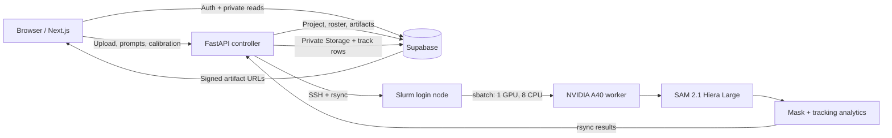

# PitchVision — SAM Football Analytics

An interactive football video intelligence system built around **SAM 2.1 video segmentation**. Upload a continuous match clip, draw first-frame boxes around players or officials, and run high-quality offline inference on a remote NVIDIA A40 through Slurm. The application returns persistent masks, trajectories, metric speed, team classification, OCR-assisted roster matching, occlusion diagnostics, a pitch heatmap, and a downloadable foreground-only video.

This repository is a portfolio-oriented, end-to-end computer vision project rather than a model-only notebook. It connects a polished web interface, secure cloud storage, a typed API, HPC job scheduling, GPU inference, and interactive analytics.

## Core experience

1. Upload an H.264 MP4 clip.
2. Draw one box around each subject on the first frame.
3. Optionally map four image points to a standard 105 x 68 metre pitch.
4. Submit one offline job to the A40 cluster.
5. Click a player in the result video to inspect the mask, persistent ID, team, number/name when OCR is reliable, current/average/top speed, distance, trajectory, heatmap, and occlusion stability.
6. Switch between the original video and the black-background foreground export.

The current version is deliberately optimized for **short, continuous camera shots**. Live streams, field cameras, handheld cameras, and drone feeds are the next input layer, not a fake toggle over an offline-only backend.

## Architecture



### Responsibilities

| Layer | Technology | Responsibility |
| --- | --- | --- |
| Web | Next.js 16, React 19, TypeScript, Tailwind | Upload, first-frame annotation, four-point calibration, progress polling, interactive mask hit-testing, trajectories, heatmap, player metrics |
| Controller | FastAPI, Pydantic, Supabase client | Input validation, Supabase synchronization, SSH/rsync, Slurm submission and status, artifact verification |
| GPU worker | PyTorch 2.11, CUDA 12.8, SAM 2.1, OpenCV, EasyOCR, FFmpeg | Video normalization, segmentation propagation, analytics, RLE masks, foreground video |
| Data | Supabase Postgres, Auth, private Storage, RLS | Projects, tracks, roster, owner isolation, source videos, generated artifacts |
| Compute | Slurm, one NVIDIA A40 | Reproducible batch inference without a permanent GPU service |

## Why SAM 2.1 instead of YOLO

YOLO is the natural choice when the main problem is automatically finding every person in every frame. This project asks a different question: **after a user identifies the subjects that matter, can the system preserve pixel-accurate identity masks and turn them into useful sports analytics?**

SAM 2.1 therefore owns segmentation and temporal propagation. The first version intentionally does not add a YOLO detector, because that would blur the evaluation of SAM's video memory and the human-in-the-loop workflow. Automatic detection can be added later as an optional prompt generator without replacing the segmentation core.

## GPU inference pipeline

The worker performs the following sequence:

1. Normalize input to a maximum of 60 seconds, 1280 x 720, 15 FPS, H.264.
2. Extract ordered JPEG frames for SAM's video predictor.
3. Load `sam2.1_hiera_large.pt` on CUDA with BF16 autocast, TF32, cuDNN benchmarking, and the compiled SAM 2 CUDA extension.
4. Convert every first-frame rectangle into a SAM box plus two positive body points.
5. Keep video frames and inference state on the GPU.
6. Apply non-overlapping constraints both to displayed masks and memory-encoder masks, preventing multiple IDs from occupying the same pixels.
7. Propagate all objects forward and transfer each frame's mask batch to CPU once.
8. Finalize a track when it disappears at an image boundary. Version 1 does not allow a later similar-looking player to inherit that ID.
9. Vectorize RLE encoding with NumPy; full-resolution masks never use a Python per-pixel loop.
10. Generate analytics and upload only verified, non-empty artifacts.

The `vos_optimized` compile path is disabled in the validated configuration. On the tested PyTorch/CUDA stack it increased first-run latency and reduced throughput. This is an evidence-based default, not a claim that compilation is universally slower.

## Analytics

### Persistent identity and exit handling

Each first-frame object ID is the persistent ID. Short occlusions use SAM's video memory. Cross-shot ReID and re-entry after leaving the frame are explicitly out of scope for version 1. A boundary-exit gate prefers a correct finished trajectory over a confident but wrong identity switch.

### Metric motion

- The foot point is the median horizontal position of the bottom 5% of mask pixels.
- Four point pairs define a homography from image coordinates to a 105 x 68 metre pitch.
- Speed uses metric foot-point displacement and frame timestamps.
- A five-frame median filter rejects spikes; an exponential moving average stabilizes the display.
- The result includes current, average, and maximum speed plus cumulative distance.

### Team, number, and name

- The upper-body mask region supplies a dominant colour sample.
- Lab-space distance assigns Spain, Argentina, or referee prototypes for the demo match.
- EasyOCR reads only digits from the sharpest multi-frame torso crops.
- Confidence-weighted voting selects a number.
- A name is returned only when `team + number` matches the Supabase roster; otherwise the UI says `Unidentified player`.

### Occlusion stability

The worker reports overlap/area-drop events, recovery frames, area recovery ratio, maximum centroid shift, exit frame, and whether the ID was retained. This makes model limitations measurable instead of hiding them behind a successful process exit.

## Output contract

Each completed job produces:

| Artifact | Purpose |
| --- | --- |
| `masks.json.gz` | Per-frame, per-object RLE masks for rendering and click hit-testing |
| `tracks.json` | Identity, team, OCR, trajectory, speed, distance, exit, and occlusion metrics |
| `foreground.mp4` | H.264 black-background video containing only accepted subject masks |
| `metrics.json` | Timing, throughput, GPU utilization, VRAM, frame/object counts, stability totals |
| `normalized.mp4` | The exact 720p/15 FPS video coordinate space used by inference |

Storage paths are private and owner-scoped:

```text
videos/{user_id}/{project_id}/source.mp4
artifacts/{user_id}/{project_id}/{artifact_name}
```

## Validated A40 benchmark

The final acceptance run used one continuous 30-second clip at 1280 x 720 and 15 FPS, with ten players and one referee selected on the first frame.

| Metric | Measured result |
| --- | ---: |
| Slurm state / exit code | `COMPLETED` / `0:0` |
| Frames / objects | 450 / 11 |
| End-to-end worker time | 183.40 s |
| Effective end-to-end throughput | 2.45 FPS |
| SAM propagation time | 142.71 s |
| SAM propagation throughput | 3.15 FPS |
| Average / peak GPU utilization | 69.29% / 100% |
| NVIDIA memory-used peak | 11,375 MB |
| PyTorch allocated / reserved peak | 10,487.7 / 11,048 MB |
| IDs retained to frame exit or video end | 11 / 11 |
| Output video | H.264, 1280 x 720, 15 FPS, 450 decoded frames |

The run completed in **3 minutes 9 seconds of Slurm wall time**, well inside the ten-minute target. GPU memory is used by real model state and multi-object work; the application does not allocate meaningless tensors merely to display a larger VRAM number.

## Author's design philosophy

This system is built around five convictions:

1. **Identity correctness is more important than uninterrupted output.** If a player leaves the frame, closing the track is better than attaching the old ID to a new player with the same shirt colour.
2. **Quality claims need artifacts and measurements.** A completed Slurm job is not enough. The masks must decode, the MP4 must play, IDs must be inspected across time, and GPU/latency figures must come from a real workload.
3. **Utilization is a diagnostic, not the product.** The goal is high-quality analysis per second. The largest speedup came from removing a Python RLE bottleneck, not from reserving more VRAM.
4. **Human intent is valuable supervision.** First-frame boxes make the tracked subjects explicit and keep version 1 focused on segmentation, identity stability, and analytics rather than detector recall.
5. **The smallest honest architecture wins.** A local FastAPI controller, system SSH/rsync, one Slurm job, and Supabase are enough. Redis, Celery, a permanent GPU service, and speculative recovery layers would add complexity before the workload requires them.

## Repository layout

```text
.
├── web/                 Next.js application and interactive result UI
├── backend/
│   ├── app/             FastAPI, auth, Supabase gateway, Slurm controller
│   ├── worker/          SAM propagation, RLE, tracking analytics
│   ├── scripts/         Remote bootstrap and sbatch entrypoint
│   └── tests/           API, homography, speed, OCR, colour, RLE, exit tests
├── supabase/migrations/ Schema, RLS, Storage, roster, service-role grants
├── smoke/               Small reproducible payloads and benchmark notes
├── SETUP.md             Full local, Supabase, and cluster setup
└── .env.example         Public configuration template without secrets
```

Source footage, generated masks/videos, checkpoints, caches, local credentials, and QA screenshots are excluded from Git.

## Quick start

See [SETUP.md](./SETUP.md) for the complete setup. The short version is:

```bash
# Backend
cd backend
uv sync --extra test
uv run uvicorn app.main:app --reload

# Frontend, in another terminal
cd web
npm ci
npm run dev
```

Open `http://localhost:3000`.

## API

| Method | Endpoint | Description |
| --- | --- | --- |
| `GET` | `/health` | Controller and scheduler identity |
| `POST` | `/v1/jobs` | Authenticated project job submission |
| `GET` | `/v1/jobs/{project_id}` | Authenticated job state and Slurm ID |
| `POST` | `/v1/offline/jobs` | Simplified local single-admin upload flow |
| `GET` | `/v1/offline/jobs/{project_id}` | Simplified local progress polling |

Job states are `queued`, `running`, `completed`, or `failed`. A project is marked completed only after Slurm reports success and every required artifact exists with a non-zero size.

## Verification

```bash
backend/.venv/bin/python -m pytest -q
cd web
npm test
npm run build
```

The validated repository state passes 10 backend tests, 2 frontend tests, and the Next.js production build. The final A40 acceptance artifacts also pass JSON/gzip parsing and full 450-frame FFmpeg decode.

## Roadmap

- RTSP/HLS/WebRTC input adapters for live streams
- Browser camera capture and authenticated field-camera ingest
- Drone and handheld-camera stabilization metadata
- Bounded queues, backpressure, and latency telemetry for live operation
- Optional detector-generated prompts while preserving manual correction
- Explicit ReID module for re-entry and camera cuts
- Human-labelled occlusion benchmark with IoU, ID retention, and recovery latency

## Scope, privacy, and media

The demo is intended for local research, portfolio recordings, and model evaluation. Match footage is not included in this public repository. Use licensed, self-recorded, or public-domain media for public deployments. Supabase buckets are private, Row Level Security is enabled, and the service-role key remains server-side.
